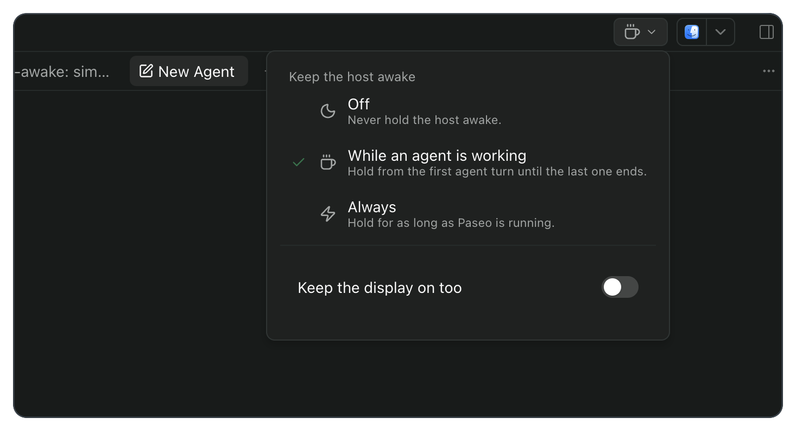
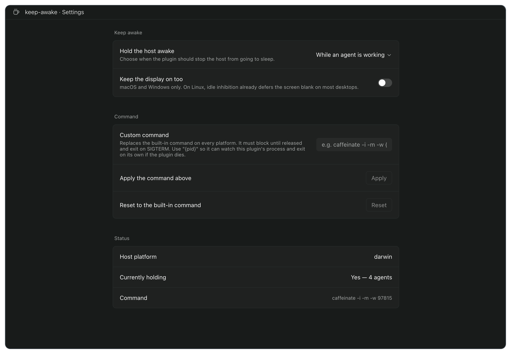

# paseo-keep-awake

Keeps the Paseo daemon host awake while agents work, then releases the hold when the last turn ends. It can also hold continuously, stay completely off, and keep the display awake on supported platforms.

Requires Paseo `>=0.9.0-beta.2`.

## Install

Install the plugin directly from this repository:

```bash
paseo plugin install github:hichamboushaba/paseo-plugins:keep-awake
paseo plugin ls keep-awake
```

For local development, install the directory instead:

```bash
paseo plugin install /absolute/path/to/paseo-plugins/keep-awake
```

`paseo plugin ls` should report `keep-awake` as `running`. After changing the source, reload it without restarting the daemon:

```bash
paseo plugin reload keep-awake
```

Paseo plugins are trusted code. The client contribution runs in the app; the server contribution runs on the daemon host with access to that machine.

## Usage

Every workspace gets a mode button in its header. The icon reflects the current mode, and pressing it opens all three choices plus the display option. It opens a menu rather than cycling: with three states, a cycling button makes you guess where the next press will land.



| Mode | Behaviour |
| --- | --- |
| **Off** | Never holds the host awake. Turn tracking continues, so changing modes is immediate. |
| **While an agent is working** | Holds from the first live agent turn until the last one ends. This is the default. |
| **Always** | Holds for as long as Paseo is running. |

The Command Center exposes the same controls as four explicit actions: one opens settings, and one selects each mode. Explicit actions work better in a search palette than a single command that cycles through hidden state.

Open **Settings → Plugins → keep-awake → ··· → Settings** for the full configuration and live status:



The screen shows the daemon platform, whether a hold is active, how many agents currently require it, and the exact command being used.

## Platform support

| Daemon platform | Built-in mechanism | Display option | Tested |
| --- | --- | --- | --- |
| macOS | `caffeinate -i -m [-d] -w <plugin pid>` | Supported with `-d` | macOS 26, Paseo 0.9.0-beta.2 |
| Linux | `systemd-inhibit --what=idle --mode=block` | Idle inhibition normally defers screen blanking | Argument-level tests only |
| Windows | PowerShell `SetThreadExecutionState` | Supported with `ES_DISPLAY_REQUIRED` | Argument-level tests only |

Linux requires systemd. An unsupported platform still loads the plugin and tracks turns, but it does not spawn a hold unless you provide a custom command.

## Custom command

The optional command replaces the built-in mechanism completely; it does not wrap or extend it. The plugin tokenizes the value and spawns the resulting program directly, without a shell.

A useful command must satisfy three properties:

1. It blocks for as long as the hold should remain active.
2. It exits when the plugin sends `SIGTERM`.
3. It should stop on its own if the plugin process dies.

Use the literal `{pid}` placeholder for the third property. It is replaced with the plugin process ID before spawning. For example:

```text
caffeinate -i -m -w {pid}
```

The placeholder is optional, but omitting it means the command has no way to notice that the plugin disappeared. A command that forks and exits immediately is also unsuitable; the settings screen reports that early exit as a command error.

While a custom command is set, **Keep the display on too** is disabled because there is no built-in command left for that option to modify. Clear the field and apply, or press **Reset**, to restore the platform default.

## How it stays correct

The server contribution listens for `agent.turn_started` and `agent.turn_ended`, tracks active agents by ID, and owns one sleep-suppression child process. Every built-in child watches the plugin PID as well as the plugin watching the child, so either side disappearing releases the operating-system assertion.

Lifecycle delivery is best-effort, so event handling alone is not enough. Every 60 seconds the plugin reconciles its tracker against the daemon's running agents in both directions: it acquires holds for starts it missed and releases holds for ends it missed. A failed query means “unknown,” never “nothing is running.” That bias is deliberate: staying awake a little too long is harmless; sleeping during a live turn is not.

Immediately after a reload there may not be a `PaseoApi` handle yet. The first reconciliation therefore falls back to `paseo agent ls -g --json`, using the `PASEO_CLI` and `PASEO_HOME` values supplied to the plugin process. Once an SDK handle is available, later reconciliations use it directly. If neither path can list agents, the plugin keeps its current hold state rather than making a destructive guess.

Settings are host-scoped and stored at version 2. Existing version 1 values migrate automatically: enabled becomes **While an agent is working**, and disabled becomes **Off**.

## Limitations

- A permission prompt does not end an agent turn, so the host remains awake while that prompt waits for an answer.
- Closing a MacBook lid still sleeps Apple Silicon machines. `caffeinate` cannot override clamshell sleep.
- The plugin prevents sleep; it cannot wake a machine that is already asleep.
- Holds are host-wide. There are no per-workspace or per-provider filters.
- Linux hosts without systemd need a custom command.
- Reload recovery depends on the plugin process being able to run the Paseo CLI until an SDK handle becomes available.

## Development

```bash
npm install
npm run typecheck
npm test
```

Both checks must pass before installing or reloading the plugin.

## License

MIT
