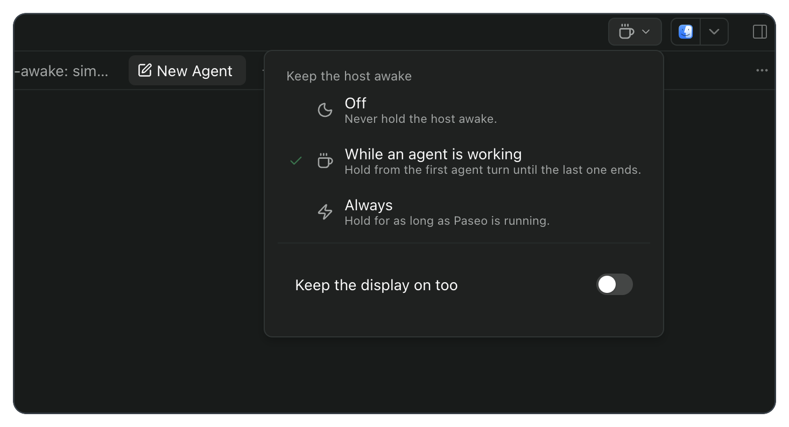
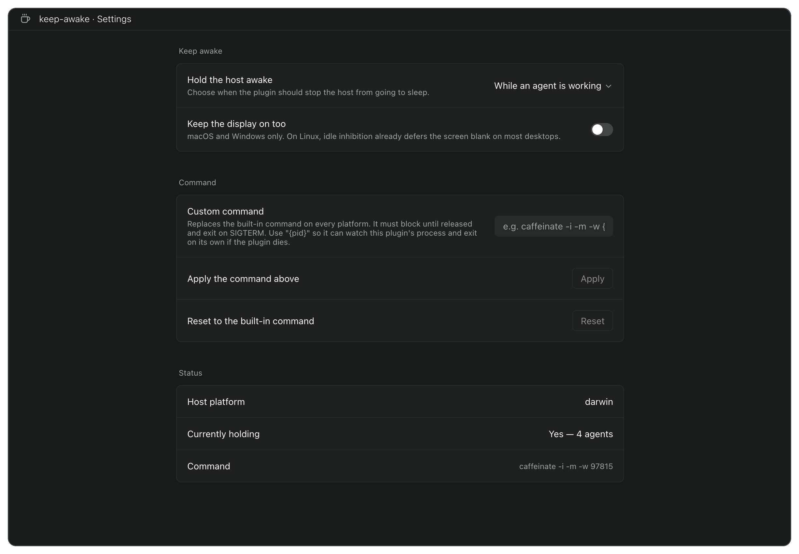

# paseo-keep-awake

Keeps the Paseo daemon host awake while agents and their subagents work, then releases the hold a minute after the last one finishes. It can also hold continuously, stay completely off, and keep the display awake on supported platforms.

Requires Paseo `>=0.9.0-beta.2`.

## Install

Install the published package from npm:

```bash
paseo plugin install npm:paseo-keep-awake
paseo plugin ls keep-awake
```

Or install straight from this repository:

```bash
paseo plugin install github:hichamboushaba/paseo-plugins:keep-awake
```

For local development, install the directory instead:

```bash
paseo plugin install /absolute/path/to/paseo-plugins/keep-awake
```

`paseo plugin ls` should report `keep-awake` as `running`. After changing the source, reload it without restarting the daemon:

```bash
paseo plugin reload keep-awake
```

Paseo plugins are trusted code. The client contribution runs in the app; the server contribution runs on the daemon host with access to that machine.

## Usage

Every workspace gets a mode button in its header. The icon reflects the current mode, and pressing it opens all three choices plus the display option. It opens a menu rather than cycling: with three states, a cycling button makes you guess where the next press will land.



| Mode | Behaviour |
| --- | --- |
| **Off** | Never holds the host awake. Turn tracking continues, so switching modes takes effect at once. |
| **While an agent is working** | Holds while any agent or its subagents are working, plus 60 seconds after the last one finishes. This is the default. |
| **Always** | Holds for as long as Paseo is running. |

The Command Center exposes the same controls as four explicit actions: one opens settings, and one selects each mode. Explicit actions work better in a search palette than a single command that cycles through hidden state.

Open **Settings → Plugins → keep-awake → ··· → Settings** for the full configuration and live status:



The screen shows the daemon platform, whether a hold is active, how many agents and subagents currently require it (or a countdown to release once none do), and the exact command being used.

## Platform support

| Daemon platform | Built-in mechanism | Display option | Tested |
| --- | --- | --- | --- |
| macOS | `caffeinate -i -m [-d] -w <plugin pid>` | Supported with `-d` | macOS 26, Paseo 0.9.1 |
| Linux | `systemd-inhibit --what=idle --mode=block`, plus `gnome-session-inhibit --inhibit suspend` in a GNOME session | Not supported | Fedora 44 (GNOME 50), Paseo 0.9.1 |
| Windows | PowerShell `SetThreadExecutionState` | Supported with `ES_DISPLAY_REQUIRED` | Argument-level tests only |

Linux requires systemd. Its idle lock is what logind's own idle suspend and KDE honor, but GNOME's auto-suspend ignores it, so in a GNOME session the plugin also takes a gnome-session inhibitor. Either lock may be unavailable; the hold lasts while at least one is held. If neither can be taken, for example on a host without systemd and outside GNOME, the hold ends at once and the settings screen reports that `sh` exited on its own. An unsupported platform still loads the plugin and tracks turns, but it does not spawn a hold unless you provide a custom command.

## Custom command

The optional command replaces the built-in mechanism completely; it does not wrap or extend it. The plugin tokenizes the value and spawns the resulting program directly, without a shell.

A useful command must satisfy three properties:

1. It blocks for as long as the hold should remain active.
2. It exits when the plugin sends `SIGTERM`.
3. It should stop on its own if the plugin process dies.

Use the literal `{pid}` placeholder for the third property. It is replaced with the plugin process ID before spawning. For example:

```text
caffeinate -i -m -w {pid}
```

The placeholder is optional, but omitting it means the command has no way to notice that the plugin disappeared. A command that forks and exits immediately is also unsuitable; the settings screen reports that early exit as a command error.

On Linux, to block every kind of suspend while agents work, including manual suspend, use `systemd-inhibit --what=idle:sleep --mode=block tail --pid={pid} -f /dev/null`. Unlike the built-in hold, it needs a local session (or a polkit rule) to take the lock.

Changing the command, or toggling **Keep the display on too**, while a hold is active carries the hold over to the new command, as long as it starts: the plugin starts the new instance first and stops the old one 10 seconds later, once the new one has had time to start. If the new command fails to start, the hold ends with the old instance and the settings screen shows the error. Expect two instances of the command to overlap briefly whenever the change succeeds.

While a custom command is set, **Keep the display on too** is disabled because there is no built-in command left for that option to modify. Clear the field and apply, or press **Reset**, to restore the platform default.

## How it stays correct

The server contribution listens for `agent.turn_started` and `agent.turn_ended`, tracks active agents by ID, and owns one sleep-suppression child process (briefly two while the command changes). A hold can be a small process tree (on Linux, a shell running two inhibitors), so releasing it signals the child's whole process group. Every built-in child watches the plugin PID as well as the plugin watching the child, so either side disappearing releases the operating-system assertion.

Subagents can outlive their parent's turn. A Claude agent can end its turn while a backgrounded subagent or workflow keeps working; Paseo reopens the parent's turn as soon as that subagent streams output, but one that stays quiet (inside a single long tool call, for example) leaves the parent idle meanwhile. Codex sub-agents run on their own threads and never reopen the parent's turn. The plugin therefore also subscribes to the daemon's `agent.provider_subagents.update` feed and holds while any subagent Paseo reports is running.

The hold does not drop the instant the last turn or subagent ends. With the display off and a short system sleep timer, macOS commits to idle sleep within seconds of the first moment no assertion exists, and a hand-off (a child agent's turn ending just before the parent it notifies starts its next one) produces exactly that gap for a few milliseconds. The plugin therefore holds for 60 seconds after the last turn or subagent finishes, and releases only if nothing resumes in that window. **Off** still releases at once, and switching back to **While an agent is working** within the window does not bring the hold back.

Changing the command while a hold is active follows the same reasoning: see [Custom command](#custom-command) for why the plugin starts the replacement before stopping the old one instead of the other way around.

Lifecycle delivery is best-effort, so event handling alone is not enough. Every 60 seconds the plugin reconciles its tracker against the daemon's running agents in both directions: it acquires holds for starts it missed and releases holds for ends it missed. This reconcile pass covers agent turns only. The plugin API has no way to list subagents, so subagent holds depend on staying subscribed to the feed above; the same 60-second tick retries that subscription if it ever fails. A failed query means “unknown,” never “nothing is running.” That bias is deliberate: staying awake a little too long is harmless; sleeping during a live turn is not.

Immediately after a reload there may not be a `PaseoApi` handle yet. The first reconciliation therefore falls back to `paseo agent ls -g --json`, using the `PASEO_CLI` and `PASEO_HOME` values supplied to the plugin process. Once an SDK handle is available, later reconciliations use it directly. If neither path can list agents, the plugin keeps its current hold state rather than making a destructive guess.

Settings are host-scoped and stored at version 2. Existing version 1 values migrate automatically: enabled becomes **While an agent is working**, and disabled becomes **Off**.

## Limitations

- A permission prompt does not end an agent turn, so the host remains awake while that prompt waits for an answer.
- Closing a MacBook lid still sleeps Apple Silicon machines. `caffeinate` cannot override clamshell sleep.
- The plugin prevents sleep; it cannot wake a machine that is already asleep.
- Holds are host-wide. There are no per-workspace or per-provider filters.
- Linux hosts without systemd need a custom command.
- At the GDM login screen, with nobody signed in, GNOME's auto-suspend runs as a different user and can't be held. If the host must stay up there, set GDM's `sleep-inactive-ac-type` to `'nothing'`.
- XFCE and Cinnamon auto-suspend isn't held yet; both ignore the logind idle lock.
- Reload recovery depends on the plugin process being able to run the Paseo CLI until an SDK handle becomes available.
- Background shell commands (such as Claude's `run_in_background`) are not reported to plugins. If an agent ends its turn while only such a command is running, the hold is released after the grace period.
- Schedules and heartbeats are not visible either; use **Always** if you rely on one to run unattended.
- After a plugin reload, the subagent feed starts with the first hook or status request, and an already-running subagent is picked up at its next progress update.
- A subagent whose final update never reaches the plugin (for example during a reconnect, or one replayed as still running shortly after a daemon restart) keeps the host awake until the plugin reloads.
- Only providers that report subagents to Paseo are covered.

## Development

```bash
npm install
npm run typecheck
npm test
```

Both checks must pass before installing or reloading the plugin.

### Releasing

Bump `version` in `package.json`, commit, and push `main`. Then push a tag that matches the new version:

```bash
git tag keep-awake/v0.1.2
git push origin keep-awake/v0.1.2
```

The tag starts the repository's publish workflow, which checks the tag against `package.json`, runs the checks above, and publishes the package to npm.

## License

MIT
